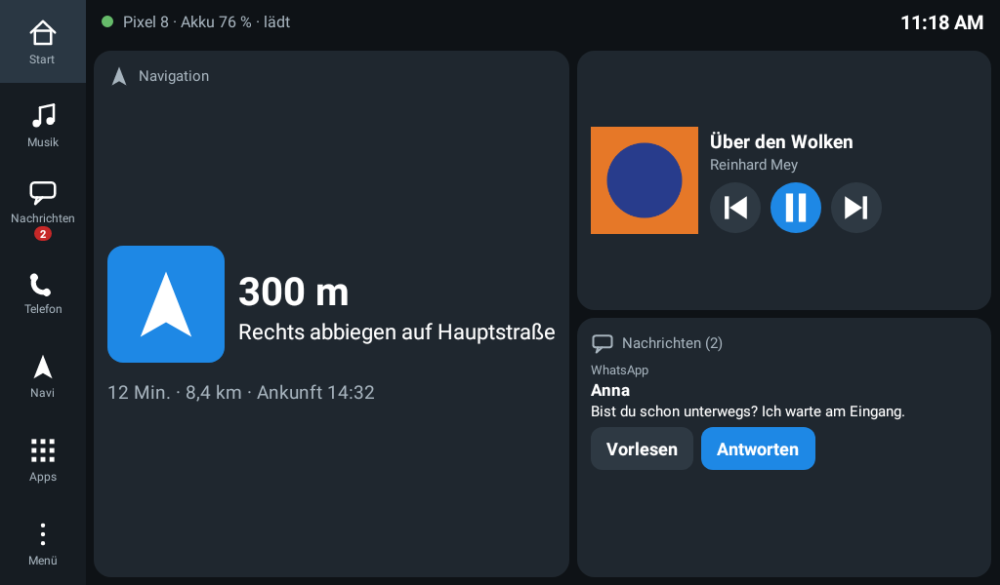
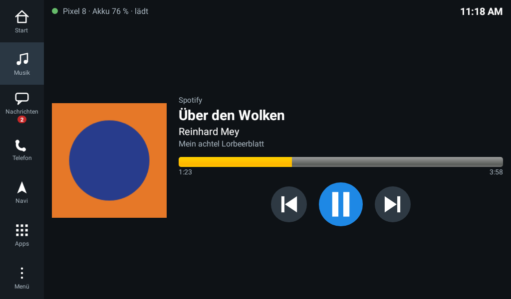
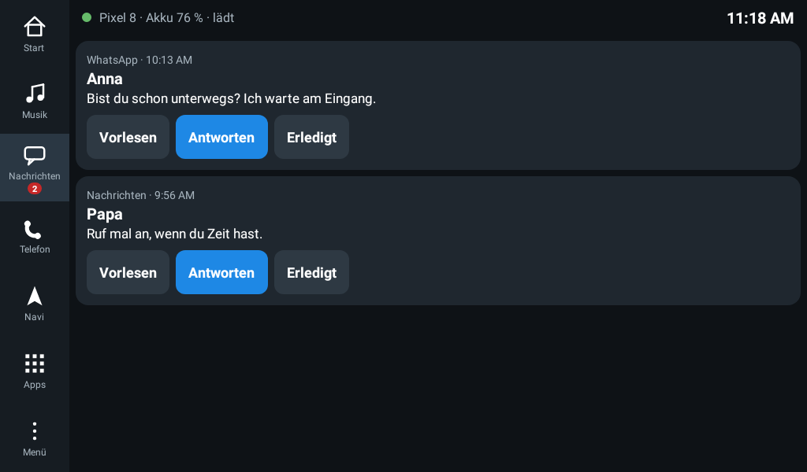
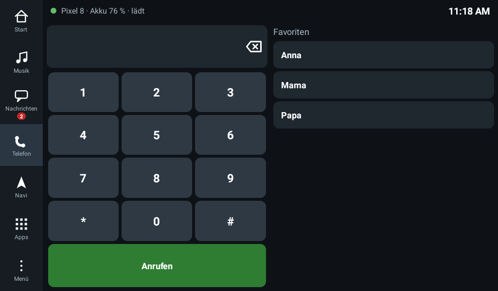
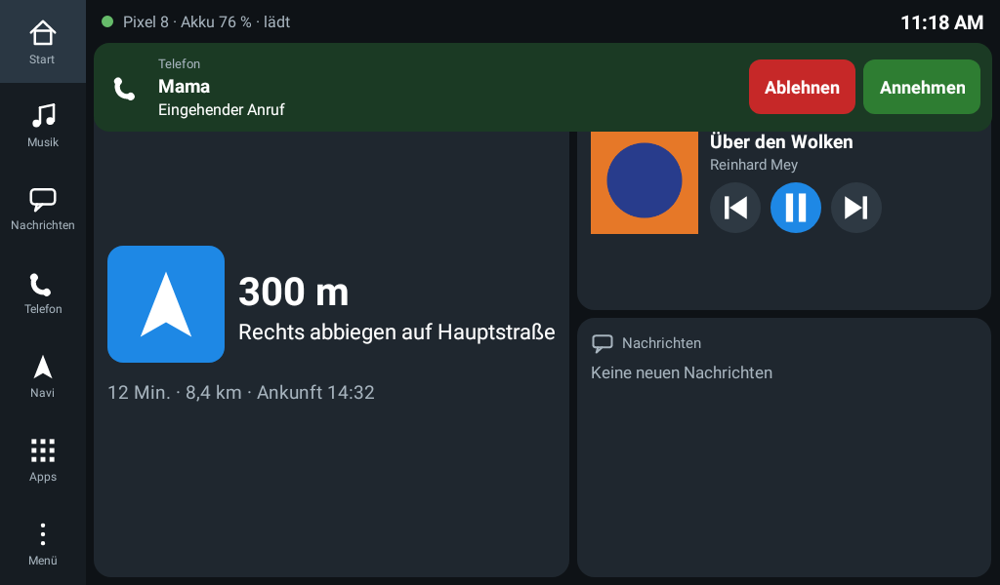

# AutoSpiegel

Kostenlose, schlanke Alternative zu Android Auto für ältere Android-Autoradios.

Das Radio bekommt **eine eigene Oberfläche im Querformat**: randvoll und ohne Verzerrung.
Das Handy bleibt dabei **ganz normal hochkant** und darf gesperrt in der Tasche oder
Halterung liegen. Es spiegelt nicht seinen Bildschirm, sondern liefert nur die Daten, so
wie es Android Auto auch macht.



| Musik | Nachrichten |
|---|---|
|  |  |
| **Telefon** | **Eingehender Anruf** |
|  |  |

*(Bilder in Radio-Auflösung 1024 × 600 mit Beispieldaten.)*

## Was das Radio kann

- **Musik:** Titel, Interpret, Cover, Fortschritt sowie Abspielen, Pause, Vor und Zurück.
  Das funktioniert mit jeder Musik-App auf dem Handy (Spotify, YouTube Music, Radio-Apps …).
- **Navigation:** Du gibst am Radio ein Ziel ein, dann startet Google Maps auf dem Handy.
  Die Abbiege-Hinweise („300 m – rechts abbiegen auf …“) erscheinen groß auf dem Radio.
- **Nachrichten:** WhatsApp, SMS, Telegram usw. werden angezeigt und **vorgelesen**.
  Antworten geht mit einem Tipp (Schnellantworten) oder per Tastatur.
- **Anrufe:** Ein eingehender Anruf erscheint mit „Annehmen“ und „Ablehnen“.
  Unter Telefon gibt es Wähltasten und deine Favoriten. Der Ton läuft über Bluetooth.
- **Apps:** Hier startest du die eigenen Apps des Radios, z. B. eine Navi-App mit Karte.
  Über den Hotspot des Handys haben sie Internet.

- **Kostenlos**, ohne Abo, ohne Werbung und ohne Google-Konto.
- **Sehr leicht fürs Radio:** Die App ist ca. 90 KB groß. Es wird kein Video übertragen,
  nur ein paar Daten. Das schafft auch ein Radio mit 1 GB RAM locker.
- **Radio:** ab Android 4.1. **Handy:** ab Android 7.

Es ist **eine** App für beide Geräte. Beim ersten Start wählst du, ob das Gerät das
Handy oder das Radio ist.

## Installieren

`AutoSpiegel.apk` liegt in diesem Ordner.

**Aufs Handy:** APK herunterladen, öffnen und die Installation aus unbekannten
Quellen erlauben.

**Aufs Radio:** Dafür gibt es drei Wege, nimm den einfachsten:
1. **Direkt vom Handy:** Installiere die App zuerst auf dem Handy und tippe dort
   „Verbindung starten“. Schalte den Hotspot ein und verbinde das Radio damit. Öffne
   dann im Browser des Radios die Adresse, die die Handy-App anzeigt (z. B.
   `http://192.168.43.1:47802`).
2. **USB-Stick:** APK auf einen Stick kopieren, am Radio mit dem Dateimanager öffnen.
3. **Browser am Radio:**
   `https://github.com/taubenmerge/tauben-merge-privacy/raw/claude/youthful-goldberg-k8i8sh/autospiegel/AutoSpiegel.apk`

## Einrichten (einmalig)

1. **Radio:** AutoSpiegel öffnen → „Das ist das Autoradio“. Es zeigt einen
   6-stelligen **Radio-Code** an.
2. **Handy:** AutoSpiegel öffnen → „Das ist mein Handy“, dann:
   1. **Benachrichtigungszugriff erlauben.** Den braucht die App für Musik,
      Navigation, Nachrichten und Anrufe. Ist der Schalter gesperrt („Eingeschränkte
      Einstellung“, ab Android 13)? Dann „App-Info öffnen“ → ⋮ oben rechts →
      „Eingeschränkte Einstellungen zulassen“ und noch einmal versuchen.
   2. **Radio-Code** eingeben → Speichern. Dadurch kann sich nur dein Radio verbinden.
   3. *Optional:* **Kontakte und Anrufe erlauben.** Dann erscheinen deine Favoriten
      (Kontakte mit Stern) am Radio.
   4. *Optional:* **„Über anderen Apps einblenden“ erlauben.** Dann kann das Radio
      die Navigation auf dem Handy starten.
   5. **„Verbindung starten“** tippen. Die Verbindung läuft danach im Hintergrund
      weiter, auch nach einem Neustart, bis du sie beendest.
3. Handy und Radio per **Bluetooth** koppeln (für Musik und Telefonate), falls noch nicht
   geschehen.

## Benutzen

1. Am Handy den **WLAN-Hotspot** einschalten. Das Radio verbindet sich damit (nach
   dem ersten Mal automatisch).
2. Am Radio AutoSpiegel öffnen. Es findet das Handy von selbst. Oben links steht
   dann der Handy-Name mit grünem Punkt.

Das Handy musst du dafür nicht anfassen. Es kann gesperrt bleiben.

## Gut zu wissen

- **Eine Karte zeigt das Radio nicht von selbst an:** Navigiert wird auf dem Handy, das
  Radio zeigt die Abbiege-Hinweise. Wer eine Karte auf dem Radio will, startet unter
  „Apps“ eine Navi-App des Radios.
- **Vorlesen** nutzt die Sprachausgabe des Radios. Fehlt sie, meldet das Radio das.
  Im Radio-Menü (⋮) kannst du einstellen, dass neue Nachrichten automatisch vorgelesen
  werden.
- Falls das Radio das Handy nicht findet: Im Radio-Menü (⋮) die Handy-IP von Hand
  eintragen.

## Technik

- Das Handy liest über einen `NotificationListenerService` die Mediensitzungen
  (`MediaSessionManager`), die Benachrichtigung der Navi-App und Nachrichten und
  Anrufe. Antworten verschickt es über `RemoteInput`, wie eine Smartwatch.
- Ein Hintergrunddienst (`connectedDevice`) schickt das per TCP (Port 47800) als kleine
  JSON-Nachrichten ans Radio, Bilder als JPEG oder PNG. Das Radio sendet Befehle zurück.
- Das Radio findet das Handy über UDP-Broadcast (Port 47801) oder das Gateway des
  Hotspots. Die Kopplung läuft über den Radio-Code.
- Port 47802 liefert die APK für das Radio aus.

## Selbst bauen

```
export ANDROID_HOME=/pfad/zum/android-sdk
./gradlew assembleRelease testReleaseUnitTest
# → app/build/outputs/apk/release/app-release.apk
# → app/build/screenshots/*.png (Radio-Bildschirme, mit Robolectric gezeichnet)
```

Der Signaturschlüssel in `signing/` ist absichtlich nicht geheim. So lässt sich jede
neue Version über die alte installieren.
